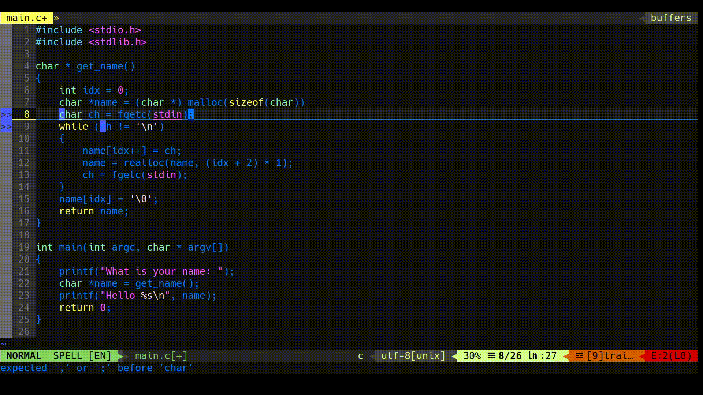
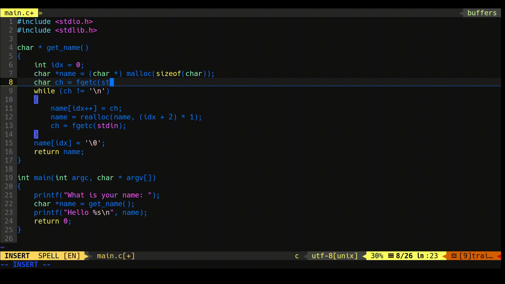
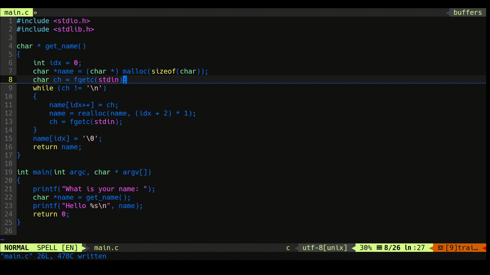
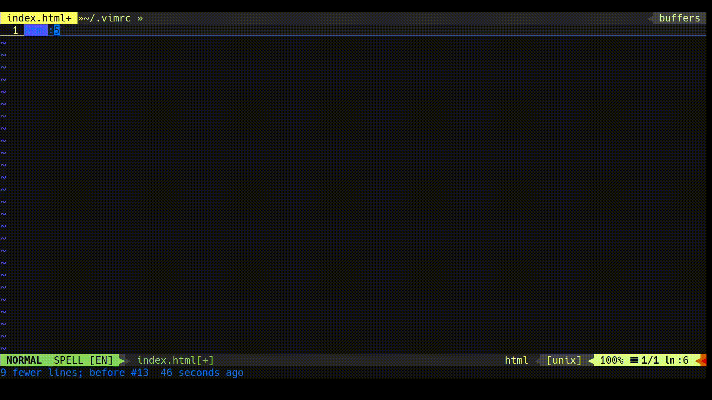

# My vimrc file
Contains very basic plugins and my own theme. Future changes to the file will be recorded here as well.

# Installation
git clone --recursive https://github.com/rachejazz/my-vimrc ~/.vim

## Error Check

## Autocomplete

## Multi-Window

## Emmet

